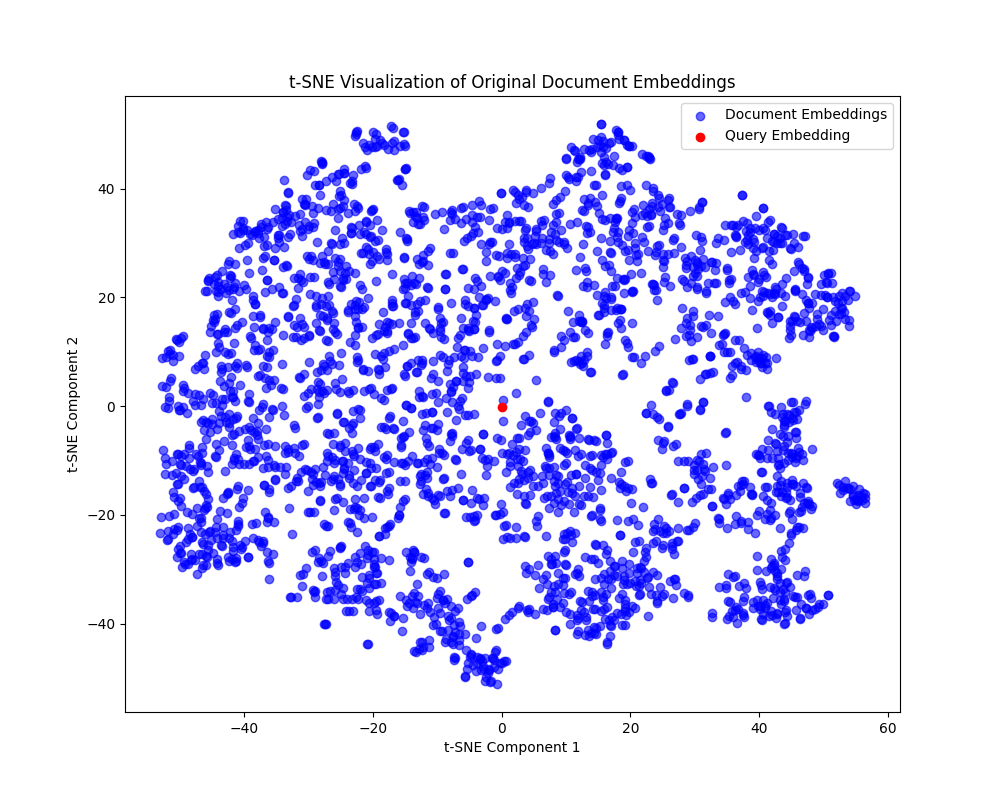
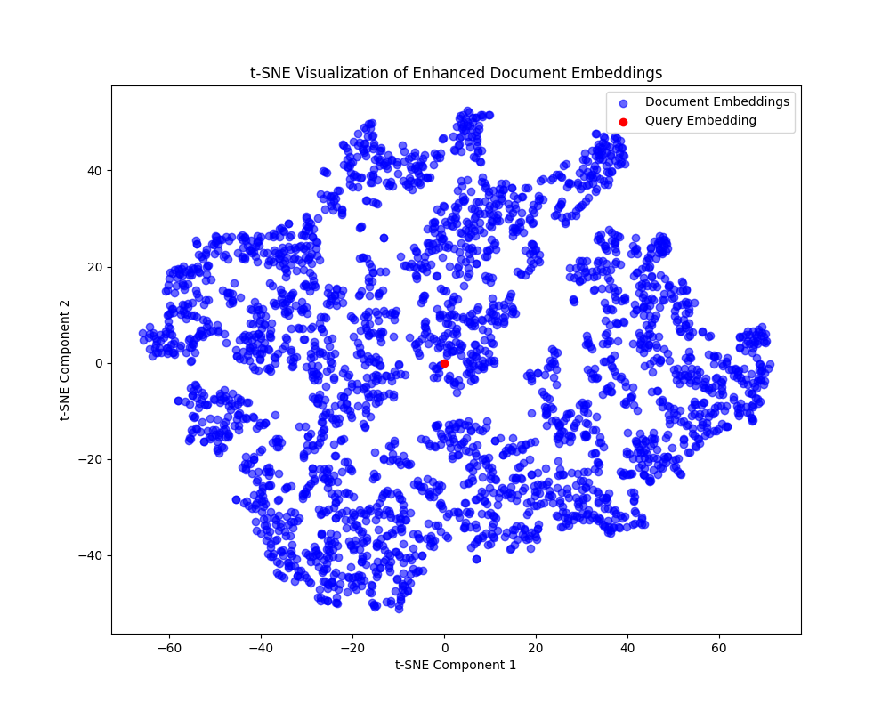

# Document Embedding Query System
This Readme file is primarily focused in adressing the Query-based search system used in this application, for more detail regarding web-scraping and API within this repository, check README_APS_1.

## Utilizing the query system

before running the API, the scripts in the repository must be used in the following order:

1. webscraper_cnn.py: Setting the pages searched to 10 is advisable for faster running, as this file scrapes data from the cnn website.
2. embedding.py: Generates base document and enhanced embeddings from the data present, using pre-trained BERT embeddings as base.

## Dataset

The dataset used for the embedding-based query system is the same used in the first version of this project, set to scrape 100 pages of news articles in order to increase sample size and generate better data clusters. Each document contains title, content and origin data. This dataset has a variable and specific nature, depending on the historic moment and current relevance of terms, which generates the need for pre-trained embeddings to fill in the gaps in semantic coverage. This allows for accurate document querying based on semantic relevance, weighted by the embeddings generated from the documents themselves, making it suitable for natural language processing (NLP) tasks involving text similarity and information retrieval.

## Embedding Generation Process

To generate embeddings, we start with pre-trained portuguese BERT embeddings as a base representation. Them we use these embeddings to generated document specific embeddings, which are them processed by an autoencoder layer that reduces the dimensionality to 32. The autoencoder effectively fine-tunes the embeddings to emphasize dataset-specific features while maintaining the general semantic information. The final output of the autoencoder serves as the enhanced, task-specific document embedding. 

## Training Process

The training process for the denoising autoencoder aims to reconstruct the embeddings as closely as possible to the original documents embeddings, with the goal of capturing both general and domain-specific semantics. We utilize Mean Squared Error (MSE) as the loss function to measure the difference between the original embeddings and their reconstructed counterparts. This loss function encourages the model to minimize the reconstruction error, effectively preserving essential features while discarding noise. By minimizing MSE, we create embeddings that capture meaningful patterns specific to the dataset, enhancing relevance in document retrieval. The loss function is defined as follows:

$$
\text{MSE} = \frac{1}{n} \sum_{i=1}^n (\hat{x}_i - x_i)^2
$$

where \( \hat{x}_i \) represents the reconstructed embedding and \( x_i \) is the original MLP-transformed embedding.

## Visualization of the results

To illustrate the effectiveness of the embedding enhancement process, two t-SNE clustering visualizations were generated. These visualizations depict the clustering of document embeddings in a 2D space, showcasing the impact of the autoencoder on the clustering quality.

The first plot represents the original BERT-based document embeddings before any dimensionality reduction by the autoencoder. Here, the data points are relatively scattered, reflecting only general semantic relationships. As BERT embeddings capture high-dimensional language features, they may not fully encapsulate domain-specific nuances relevant to the dataset, resulting in less distinct clustering patterns.

The second plot displays the enhanced document embeddings after they have been processed by the autoencoder. By reducing the embeddings to a lower-dimensional space (32 dimensions) while retaining essential information, the autoencoder helps improve the clustering of semantically similar documents. As seen in this plot, data points form more distinct clusters, indicating that the autoencoder effectively captures domain-specific semantics. This enhances the quality of document retrieval, as embeddings now reflect dataset-specific similarities more accurately.

To visualize the embeddings in a 2D space, a t-distributed Stochastic Neighbor Embedding (t-SNE) algorithm was applied. t-SNE is a popular technique for visualizing high-dimensional data by reducing it to two or three dimensions, often used to reveal clustering patterns in datasets. It works by minimizing the divergence between probability distributions of the points in high-dimensional and low-dimensional spaces, effectively preserving local structures of the data while allowing for meaningful clustering representation in lower dimensions.

t-SNE is commonly paired with PCA in high dimensionality data, as the initial embeddings had over one thousand components, a PCA was applied to reduce them to 10. Different reduction approaches will result in different visual representations, those present in this document were made to better show the position of the query within the document corpus.

## Query Relevance

The choice of Euclidean distance for measuring query relevance was made in consideration of the setup made in the document embedding system, especially after the embeddings are reduced to 32 dimensions. Euclidean distance effectively captures similarity by calculating the straight-line distance between points, which is both computationally efficient and intuitive for lower-dimensional spaces. This efficiency is essential for real-time querying, as it enables quick similarity calculations across the embedding space. Moreover, because the autoencoder has emphasized key dataset-specific features, the Euclidean distance helps reflect meaningful document relationships. 

<!-- When combined with t-SNE visualizations, which preserve local structures, Euclidean distance further enhances the ability to retrieve semantically relevant documents based on their spatial proximity, improving the accuracy and relevance of query results. -->